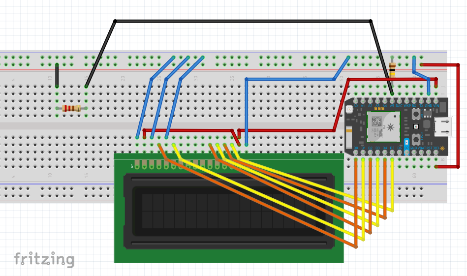

# Blynk-Ohm-Meter

A Particle project to display a resistance value on a physical LCD screen as well as on the Blynk App Value Display.

Additionally, a `Particle.variable()` is registered. Use the `curl` command below to query its value.

## Wiring
The resistor on the far left should be replaced with the unknown resistor.

The resistor on the right is the known resistor. Its value should be on the order of the unknown resistor.




## Curl command
```
$ curl -G https://api.particle.io/v1/devices/<your_device_id>/resistVal -d access_token=<your_access_token> | python -m json.tool
```
